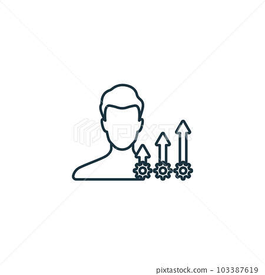

# Aashutosh Basnet

**`Computer Science student / ... `**

I am a computer science student pursuing my cs degree in Bhaktapur Multiple Campus. I aspire to be a great programmer.

<table style="border-collapse: collapse; width: 100%;">
  <tr style="border: none;">
    <td style="border: none;">
      
    </td>
    <td style="border: none;">
      <h3>Languages and Tools</h3>
    </td>
  </tr>
</table>

  &nbsp;
   &nbsp;
   &nbsp;
  &nbsp;
   &nbsp;
  &nbsp;

